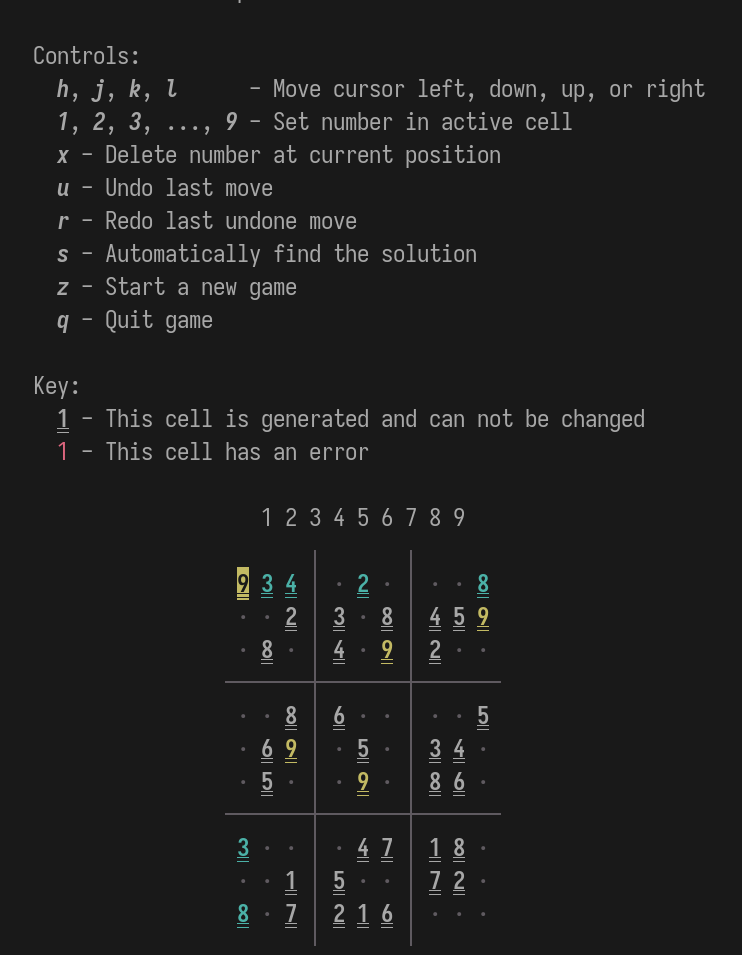

# Sudoku

A TUI Sudoku written in pure pre-ANSI* C.

*Not quite, as there are some "modern" features that I wanted to
use.  It is sill c89 compliant and uses the pre-ansi function
declarations, though 😛 

